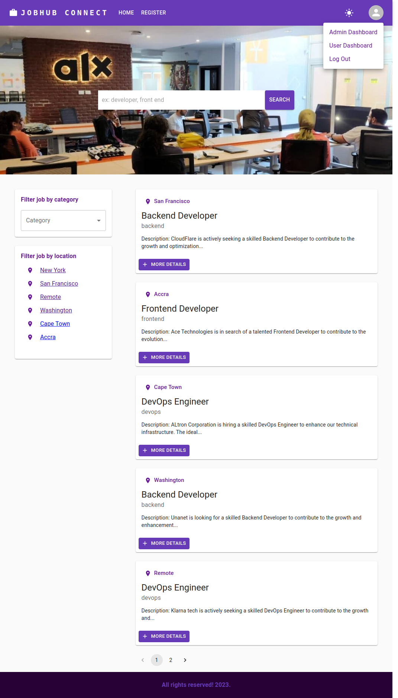
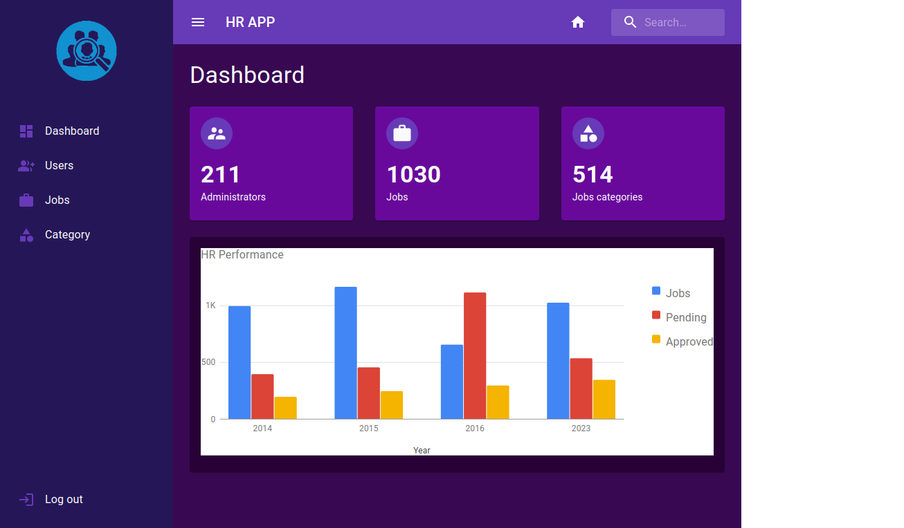
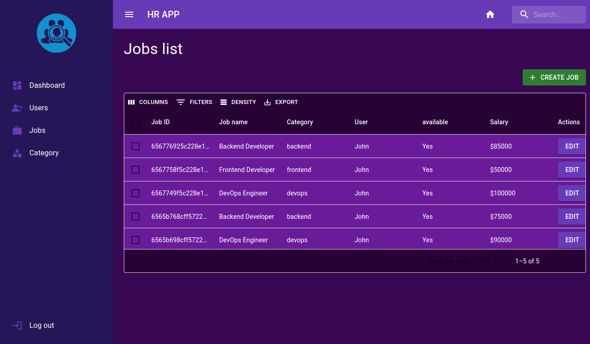

# JobHub Connect-mern-stack
This is a Full stack job App made with MERN Stack, MUI, Datagrid, cookie, react-google-charts etc









# Features:
##### - Software Architecture: MVC pattern;
##### - HOC (High Order Component);
##### - Dark & Light theme mode with MUI (Material UI);
##### - Admin & user dashboard, pagination, Datagrid, Download in CSV, etc;
##### - Open & close dashboard sidebar;
##### - Admin can create jobs, create category, etc.
##### - Dashboard Analytic;
##### - Responsive App / MUI: Material UI;
##### - User can see his jobs history in user dashboard;
##### - Log In & Register Form with Formik and Yup for validation;
##### - Modern authentication system with JWT and cookie;
##### - Search job, filter jobs by category and location;
##### - Apply for a job in the single page job, if the user is already log In;
##### - Toast notification;

### Built With

Frameworks and tools that were used to develop Foodie express.

* [![Express][Express.js]][Express-url]
* [![React][React.js]][React-url]
* [![Javascript][Javascript.dev]][Javascript-url]
* [![Mongo][Mongo.dev]][Mongo-url]
* [![Material-UI][MaterialUI.com]][MaterialUI-url]

<p align="right">(<a href="#readme-top">back to top</a>)</p>


<!-- GETTING STARTED -->
## Getting Started

Instructions on setting up your project locally.
To get a local copy up and running follow these simple example steps.

### Prerequisites

This is an example of how to list things you need to use the software and how to install them.
* npm
  ```sh
  npm install npm@latest -g
  ```

### Installation

_Below is an example of how you can instruct your audience on installing and setting up your app. This template doesn't rely on any external dependencies or services._

1. Clone the repo
   ```sh
   https://github.com/JohnKamaujk/foodie-express.git
   ```
2. cd into the frontend folder
   ```sh
   cd frontend/
   ```
3. Install NPM packages
   ```sh
   npm install
   ```
4. Create a dot env file inside the frontend folder and set up env variables
   ```sh
   VITE_API_BASE_URL=
   VITE_AUTH0_DOMAIN=
   VITE_AUTH0_CLIENT_ID=
   VITE_AUTH0_CALLBACK_URL=
   VITE_AUTH0_AUDIENCE=
   ```
5. cd into the backend folder
   ```sh
   cd backend/
   ```
3. Install NPM packages
   ```sh
   npm install
   ```
4. Create a dot env file inside the backend folder and set up env variables
   ```sh
   MONGODB_URI =
   AUTH0_AUDIENCE=
   AUTH0_ISSUER_BASE_URL=
   CLOUDINARY_CLOUD_NAME=
   CLOUDINARY_API_KEY=
   CLOUDINARY_API_SECRET=
   FRONTEND_URL=
   STRIPE_API_KEY=
   STRIPE_WEBHOOK_SECRET=
   ```
5. Then run both the backend and frontend servers using
    ```sh
    npm run dev
    ```
<p align="right">(<a href="#readme-top">back to top</a>)</p>


<!-- MARKDOWN LINKS & IMAGES -->
<!-- https://www.markdownguide.org/basic-syntax/#reference-style-links -->
[React.js]: https://img.shields.io/badge/React-20232A?style=for-the-badge&logo=react&logoColor=61DAFB
[React-url]: https://reactjs.org/
[Express.js]: https://img.shields.io/badge/Express.js-35495E?style=for-the-badge&logo=express&logoColor=4FC08D
[Express-url]: https://expressjs.com/
[Javascript.dev]: https://img.shields.io/badge/Typescript-DD0031?style=for-the-badge&logo=typescript&logoColor=white
[Javascript-url]: https://www.typescriptlang.org/
[Mongo.dev]: https://img.shields.io/badge/Mongo-4A4A55?style=for-the-badge&logo=mongo&logoColor=FF3E00
[Mongo-url]: https://mongo.dev/